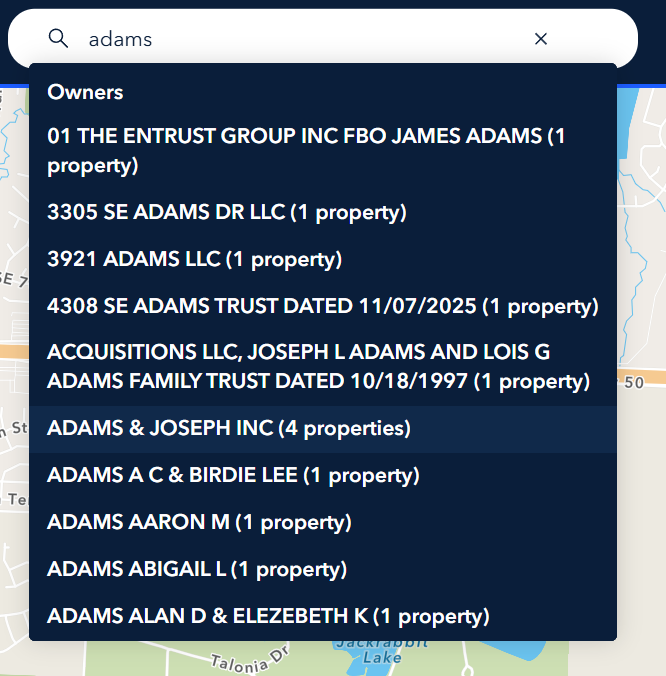
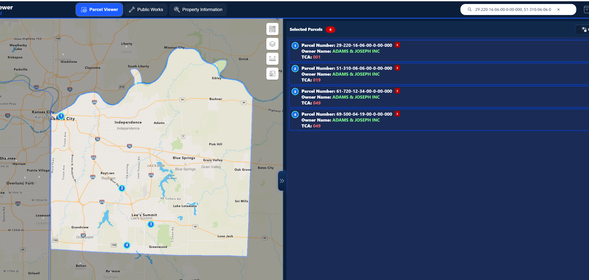
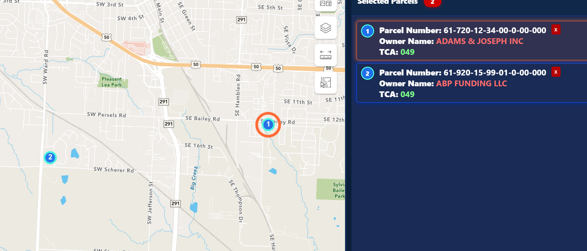

# Q3 2026 Beta Update: Parcel Search and Multi-Select Improvements

Standalone page: [Q3 2026 Internal Parcel Viewer Beta Updates](../q3-2026-internal-parcel-viewer-beta-updates.html)

This release improves the Parcel Viewer workflows users touch most often: searching, selecting multiple parcels, and seeing where selected parcels are on the map.

It also supports the larger parcel-data direction for the application: parcel details should come from AGOL-hosted parcel information instead of direct end-user workflows depending on Tyler API lookups. The longer-term concept is to collaborate Tyler-derived data into AGOL so each parcel can be represented as a single parcel record with the needed Tyler values included.

## Owner Search

Users can now search by owner name from the Parcel Viewer search bar. When the search starts with letters, the app shows owner-name results with the number of properties found.

  

What changed for users:

- Type an owner name, such as `adams`, in the search bar.
- Owner suggestions show the property count.
- Selecting an owner selects that owner's matching parcels.
- The map zooms out so the selected parcels can be seen together.
- If more than 20 properties match, the first 20 are selected.

## Pasted Parcel Lists

Users can paste a list of parcel numbers into the search bar and select them all at once.

  

Supported list formats:

- Comma with no space: `29-220-16-06-00-0-00-000,51-310-06-06-00-0-00-000`
- Comma with a space: `29-220-16-06-00-0-00-000, 51-310-06-06-00-0-00-000`
- Semicolons or new lines
- Full dashed parcel numbers
- 17-digit parcel IDs with no dashes

When the list is valid, all matching parcels are selected and the map zooms to the combined extent. Pressing Enter after pasting a valid list should not show a warning. If the list has a formatting issue, the app now shows an in-app notice instead of a browser alert.

## Multi-Select Map Markers

Multi-selected parcels now have numbered map markers that match the selected parcel list.

  

What users can do:

- Use the numbered markers to see where each selected parcel is located.
- Hover a selected parcel row to flash the matching point on the map.
- Click a selected parcel row, outside the red remove button, to zoom to that parcel while keeping the full list selected.
- Remove a parcel and the remaining map markers renumber automatically.
- If only one parcel remains, the map zooms to that parcel and the numbered multi-select markers are cleared.

## Selected Parcel List

The selected parcel list now shows the current owner name and TCA for multi-selected parcels. These values come from the current Parcel Information service, so users see current owner and tax code area values for each selected parcel.

This is part of the move toward AGOL as the shared parcel-information source. Owner and TCA values used by the multi-select list are read from the AGOL Parcel Information service by parcel ID.

## AGOL Parcel Data Direction

This beta starts aligning parcel workflows around AGOL-hosted parcel information.

- Current owner and TCA values are read from the Parcel Information service in AGOL.
- Parcel lookups are based on the parcel ID without dashes when needed.
- The intended future model is a single AGOL parcel record that includes the Tyler-collaborated values needed by Parcel Viewer.
- This is still a concept direction, but the current work prepares the app for that model.

## Single Parcel Details

Single parcel selection still opens the full detail pane with:

- Basic parcel information
- Current owner and address
- TCA and district information
- Recent value rows
- Legal description
- Parcel photos when available

The shorter owner/TCA card layout is only for multi-select lists. Single parcel selections continue to use the full details view.

## Quick Summary

- Search by owner name when you know the owner.
- Paste a parcel list when you need to select several parcels at once.
- Use numbered markers to understand where selected parcels are located.
- Hover or click a selected row to focus a specific selected parcel.
- Remove parcels from the list as needed; markers and zoom update automatically.
